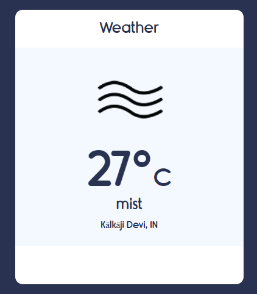

  &nbsp;  &nbsp;  

# Hi Everyone!
Today we're going to create a new web application with JavaScript (Vanilla JavaScript: No Framework).

# Weather-web-App
This weather Web-App is made with Html, Css & js 

🎇When the user clicks on the temperature value, that will convert it from Celsius to Fahrenheit.

🎈The icons we're going to use for our web application are created by the Graphic Designer.
Link to her Repo: https://github.com/manifestinteractive/weather-underground-icons

🎆The API provider is http://www.OpenWeatherMap.org

🎁You can try this calculator by using this link => [https://weather-app0002.netlify.app/)

<h3 align="center">Show some ❤ by  some repositories .</h3>

 

